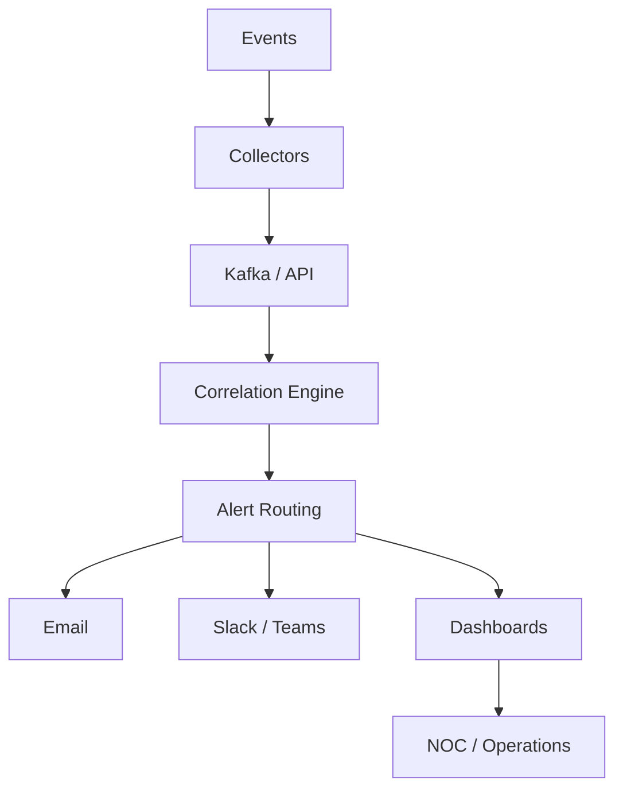

<!--
README.md for your GitHub Profile Landing Page

How to use:
1. Create a public GitHub repo named exactly the same as your GitHub username.
2. Copy this entire file into README.md.
3. Replace YOUR-GITHUB-USERNAME, YOUR-DOMAIN, YOUR-LINKEDIN, and any project names.
-->

<div align="center">

# ⚡ SHAYNE BALDUF // DEV OPS LAB ⚡


<br />


<br />


<br />
<br />


</div>

---

<div align="center">


</div>

## 🧬 SYSTEM IDENTITY

```yaml
operator: Shayne Balduf
role: ITSM / Monitoring / Automation Engineer
mission: Build resilient operations platforms, monitoring systems, and lab automation
focus:
  - Enterprise monitoring
  - Event correlation
  - Notification workflows
  - Homelab infrastructure
  - Docker and Linux services
  - Proxmox VE automation
  - Cloud and hybrid operations
status: Online
```

---

<div align="center">


</div>

---

## 🛰️ COMMAND CENTER

<table>
<tr>
<td width="50%">

### 🔭 Current Focus

* Proxmox VE lab automation
* Terraform and Ansible workflows
* Datadog and SolarWinds modernization
* Docker-based internal tools
* Event correlation platforms
* Notification and alert routing systems

</td>
<td width="50%">

### 🧠 Core Strengths

* Monitoring architecture
* IT operations engineering
* Linux server deployment
* Web app prototyping
* Dashboard design
* API and webhook integrations

</td>
</tr>
</table>

---

## 🕹️ CYBER DASHBOARD

<div align="center">

<table>
<tr>
<td align="center" width="25%">

<br />
<strong>Reliability</strong>
</td>
<td align="center" width="25%">

<br />
<strong>Automation</strong>
</td>
<td align="center" width="25%">

<br />
<strong>Observability</strong>
</td>
<td align="center" width="25%">

<br />
<strong>Homelab</strong>
</td>
</tr>
</table>

</div>

---

## 🛠️ TECHNOLOGY GRID

<div align="center">

### Infrastructure / Platforms


### Monitoring / Observability


### Automation / Code


### Data / Messaging / Web


</div>

---

<div align="center">


</div>

---

## 🧪 ACTIVE LAB PROJECTS

```text
┌──────────────────────────────────────────────────────────────┐
│                      CYBER LAB STATUS                        │
├──────────────────────────────┬───────────────────────────────┤
│ Proxmox VE Cluster           │ Online                        │
│ Docker Services              │ Deploying                     │
│ Monitoring Stack             │ Tuning                        │
│ Event Correlator             │ Building                      │
│ Notification Platform        │ Prototyping                   │
│ GitHub Automation            │ Expanding                     │
└──────────────────────────────┴───────────────────────────────┘
```

### Featured Work

| Project                      | Description                                                                | Stack                         |
| ---------------------------- | -------------------------------------------------------------------------- | ----------------------------- |
| **Event Correlator**         | Real-time event ingestion, matching, grouping, and alert correlation       | Python, Kafka, MySQL, PHP     |
| **Notification System**      | Alert routing and message delivery for operations teams                    | PHP, MySQL, SNS, Slack, Teams |
| **Proxmox Automation Lab**   | LXC and VM automation using repeatable infrastructure-as-code patterns     | Proxmox, Terraform, Ansible   |
| **Monitoring Modernization** | SolarWinds, Datadog, dashboards, alert strategy, and operational reporting | SolarWinds, Datadog, Grafana  |
| **Homelab DMZ Stack**        | Secure self-hosted apps behind reverse proxies and DNS automation          | Docker, NGINX, Cloudflare     |

---

## 🧠 ARCHITECTURE RADAR

<div align="center">



</div>

---

## 📡 OPS PHILOSOPHY

> Build systems that are observable, recoverable, documented, and boring in production.

I like technology that makes operations cleaner, faster, and easier to understand. My goal is to turn noisy infrastructure into clear signals, useful dashboards, automated workflows, and reliable alerts.

---

## 📊 TELEMETRY

<div align="center">


<br />
<br />


<br />
<br />


<br />
<br />

<picture>
  <source media="(prefers-color-scheme: dark)" srcset="https://raw.githubusercontent.com/YOUR-GITHUB-USERNAME/YOUR-GITHUB-USERNAME/output/github-contribution-grid-snake-dark.svg" />
  <source media="(prefers-color-scheme: light)" srcset="https://raw.githubusercontent.com/YOUR-GITHUB-USERNAME/YOUR-GITHUB-USERNAME/output/github-contribution-grid-snake.svg" />
  
</picture>

</div>

---

## 🧭 CONNECT

<div align="center">

[](https://github.com/YOUR-GITHUB-USERNAME)
[](https://YOUR-DOMAIN.com)
[](https://linkedin.com/in/YOUR-LINKEDIN)

</div>

---

<div align="center">

```text
╔══════════════════════════════════════════════════════════════╗
║  SYSTEM MESSAGE                                             ║
║  Keep it observable. Keep it automated. Keep it documented. ║
╚══════════════════════════════════════════════════════════════╝
```

### ⚡ End of Transmission ⚡

</div>
