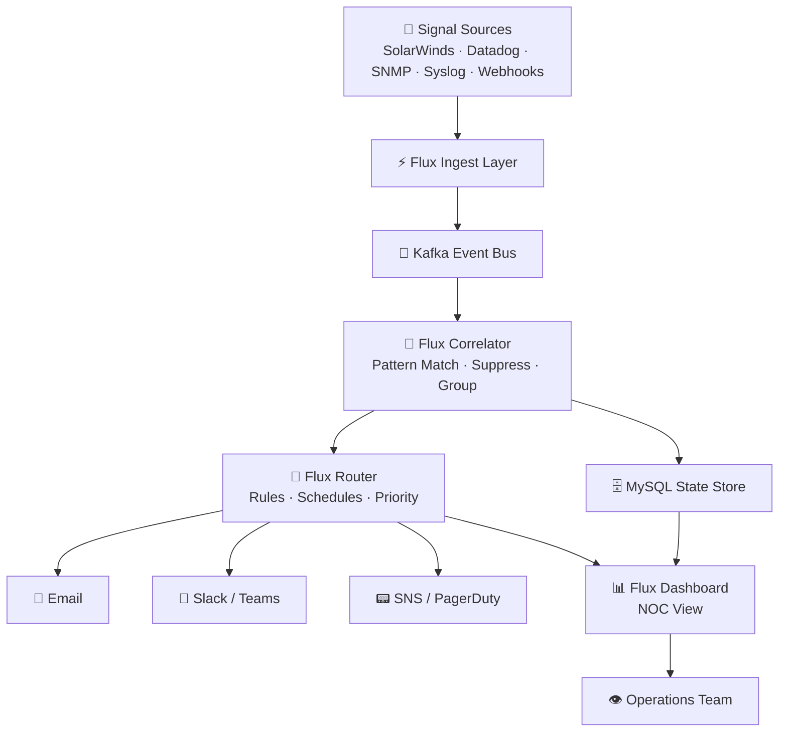

<!--
README.md — GitHub Profile Landing Page
Repo: create a public repo named exactly your GitHub username.
Replace YOUR-GITHUB-USERNAME, YOUR-DOMAIN, YOUR-LINKEDIN throughout.
Logo: commit images/github-logo.png to the same repo.
-->

<div align="center">


<br />
<br />

# ⚡ SHAYNE BALDUF ⚡
### `[ SYSTEMS ARCHITECT · PLATFORM ENGINEER · AUTOMATION OPERATOR ]`


<br />


<br />


<br />
<br />


</div>

---

## 🧬 SYSTEM IDENTITY

```yaml
╔══════════════════════════════════════════════════════════════╗
║  OPERATOR PROFILE — AUTHENTICATED                           ║
╠══════════════════════════════════════════════════════════════╣
  operator     : Shayne Balduf
  clearance    : ARCHITECT / ENGINEER
  role         : Platform Architect · ITSM · Monitoring · Automation
  mission      : Design and build resilient, self-healing operations
                 platforms from the ground up — architecture to atoms.
  focus:
    - Platform architecture & systems design
    - Enterprise monitoring & observability engineering
    - Event correlation & intelligent alert routing
    - Full-stack internal tooling (Flux · Aviondash suites)
    - Homelab infrastructure & Docker orchestration
    - Proxmox VE · Linux · Cloud & hybrid operations
    - Notification systems · webhook engineering
  status       : Online · Always building
╚══════════════════════════════════════════════════════════════╝
```

---

<div align="center">


</div>

---

## 🛰️ COMMAND CENTER

<table>
<tr>
<td width="50%" valign="top">

### 🔭 Architect's Scope

* Design systems from zero — concept → schema → production
* Define monitoring architectures across multi-platform environments
* Terraform and Ansible infrastructure as repeatable, versionable code
* Event-driven platform design: ingest → correlate → act → recover
* API-first internal tooling with clean integration contracts
* Security-conscious architecture: DMZ layers, VLAN segmentation, zero-trust patterns

</td>
<td width="50%" valign="top">

### 🧠 Engineer's Toolkit

* Build what the architecture demands — full-stack, back to front
* Python, PHP, PowerShell automation pipelines
* Docker orchestration across 30+ containerized services
* Kafka-driven messaging and event stream processing
* Dashboard design, alert strategy, and operational reporting
* Observability tuning: signal-to-noise ratio as a first-class metric

</td>
</tr>
</table>

---

## 🕹️ CYBER DASHBOARD

<div align="center">

<table>
<tr>
<td align="center" width="20%">

<br /><strong>Reliability</strong>
</td>
<td align="center" width="20%">

<br /><strong>Automation</strong>
</td>
<td align="center" width="20%">

<br /><strong>Observability</strong>
</td>
<td align="center" width="20%">

<br /><strong>Homelab</strong>
</td>
<td align="center" width="20%">

<br /><strong>Platforms</strong>
</td>
</tr>
</table>

</div>

---

## 🚀 FLUX PLATFORM — BUILT BY ME

> *Flux is a suite of purpose-built internal operations tools — designed from the ground up to modernize how IT operations teams monitor, correlate, and respond to infrastructure events.*

<div align="center">

```text
╔══════════════════════════════════════════════════════════════════════╗
║   ███████╗██╗     ██╗   ██╗██╗  ██╗                               ║
║   ██╔════╝██║     ██║   ██║╚██╗██╔╝                               ║
║   █████╗  ██║     ██║   ██║ ╚███╔╝                                ║
║   ██╔══╝  ██║     ██║   ██║ ██╔██╗                                ║
║   ██║     ███████╗╚██████╔╝██╔╝ ██╗                               ║
║   ╚═╝     ╚══════╝ ╚═════╝ ╚═╝  ╚═╝  Operations Platform         ║
╚══════════════════════════════════════════════════════════════════════╝
```

</div>

| App | Description | Stack |
|-----|-------------|-------|
| **Flux Core** | Central event ingestion engine — collects raw signals from SolarWinds, Datadog, SNMP traps, syslog, and webhook sources into a unified stream | Python, Kafka, MySQL |
| **Flux Correlator** | Real-time pattern matching and event grouping engine; suppresses noise, surfaces actionable incidents, and links related alerts across systems | Python, MySQL, Redis |
| **Flux Router** | Intelligent alert routing with rule-based escalation paths, on-call schedules, and priority tiering across teams and channels | PHP, MySQL |
| **Flux Notify** | Multi-channel notification delivery — Email, Slack, Teams, SNS, PagerDuty-style workflows — with delivery tracking and suppression logic | PHP, SNS, Slack API |
| **Flux Dashboard** | Operator-facing real-time NOC dashboard: live event stream, correlation groups, SLA timers, and acknowledgement workflows | PHP, JS, MySQL |
| **Flux Audit** | Full action log and decision trail for every alert routing decision, suppression rule, and notification sent — built for post-incident review | MySQL, PHP |
| **Flux API** | RESTful integration layer exposing Flux internals to external systems, CI/CD pipelines, and automation scripts | PHP, REST, JSON |
| **Flux Config** | GUI-driven rule builder for correlation logic, suppression windows, routing trees, and escalation policies — no code required for ops teams | PHP, JS, MySQL |

---

## ✈️ AVIONDASH SUITE — BUILT BY ME

> *Aviondash is a modular web application suite built for aviation operations contexts — purpose-designed dashboards, data tools, and operational interfaces where precision and uptime are non-negotiable.*

<div align="center">

```text
╔══════════════════════════════════════════════════════════════════════╗
║    █████╗ ██╗   ██╗██╗ ██████╗ ███╗   ██╗██████╗  █████╗ ███████╗║
║   ██╔══██╗██║   ██║██║██╔═══██╗████╗  ██║██╔══██╗██╔══██╗██╔════╝║
║   ███████║██║   ██║██║██║   ██║██╔██╗ ██║██║  ██║███████║███████╗║
║   ██╔══██║╚██╗ ██╔╝██║██║   ██║██║╚██╗██║██║  ██║██╔══██║╚════██║║
║   ██║  ██║ ╚████╔╝ ██║╚██████╔╝██║ ╚████║██████╔╝██║  ██║███████║║
║   ╚═╝  ╚═╝  ╚═══╝  ╚═╝ ╚═════╝ ╚═╝  ╚═══╝╚═════╝ ╚═╝  ╚═╝╚══════╝║
╚══════════════════════════════════════════════════════════════════════╝
```

</div>

| App | Description | Stack |
|-----|-------------|-------|
| **Aviondash Core** | Central portal and navigation layer for the Aviondash suite — role-based access, session management, and unified app launcher | PHP, MySQL, JS |
| **Aviondash Ops** | Live operations dashboard for status visibility across infrastructure services and dependencies critical to operational uptime | PHP, JS, REST APIs |
| **Aviondash Reports** | Automated report generation engine — scheduled, on-demand, and triggered reporting with export to PDF, CSV, and email delivery | PHP, MySQL, FPDF |
| **Aviondash Alerts** | Configurable threshold alerting system tied to operational metrics; visual and email-based alert delivery with escalation paths | PHP, MySQL |
| **Aviondash Tracker** | Asset and resource tracking module — lifecycle management, assignment history, and audit trail for operational inventory | PHP, MySQL |
| **Aviondash Docs** | Internal knowledge base and runbook management — versioned documentation with search, tagging, and access controls | PHP, MySQL, JS |
| **Aviondash Portal** | External-facing status page and communication hub for publishing service health, planned maintenance, and incident updates | PHP, MySQL |
| **Aviondash Admin** | Centralized administration console for user management, role configuration, system settings, and suite-wide audit logs | PHP, MySQL |

---

## 🧪 ACTIVE LAB PROJECTS

```text
┌──────────────────────────────────────────────────────────────────┐
│                    CYBER LAB STATUS BOARD                        │
├──────────────────────────────────┬───────────────────────────────┤
│ Proxmox VE Cluster               │ ✅ Online                     │
│ Docker Services (30+ containers) │ ⚙️  Expanding                 │
│ Flux Platform v2                 │ 🔨 Building                   │
│ Aviondash Suite                  │ 🔨 Iterating                  │
│ Prometheus / Grafana Stack       │ 📐 Deploying                  │
│ Datadog Integration Layer        │ 🔬 Evaluating                 │
│ Cisco CML2 Lab Network           │ 🌐 Running                    │
│ Multi-VLAN Monitoring Coverage   │ 🔧 Tuning                     │
│ Home Assistant Automation        │ 📋 Roadmap                    │
│ GitHub Actions Pipelines         │ 🚀 Expanding                  │
└──────────────────────────────────┴───────────────────────────────┘
```

### Featured Architecture Work

| Project | Description | Stack |
|---------|-------------|-------|
| **Flux Platform** | Full event correlation and notification platform — 8 integrated apps from ingestion to delivery | Python, Kafka, PHP, MySQL |
| **Aviondash Suite** | 8-app modular operations web suite for aviation-context operational tooling | PHP, MySQL, JS |
| **Proxmox Automation Lab** | LXC and VM automation using repeatable infrastructure-as-code patterns | Proxmox, Terraform, Ansible |
| **Monitoring Modernization** | Multi-platform observability: SolarWinds, Datadog, Grafana, dashboards, and alert strategy | SolarWinds, Datadog, Grafana |
| **Homelab DMZ Stack** | Secure self-hosted apps behind VLAN-segmented reverse proxies and automated DNS | Docker, NGINX, Cloudflare, Pi-hole |
| **Event Correlation Engine** | Real-time pattern recognition across multi-source alert streams — noise in, signal out | Python, Kafka, Redis, MySQL |
| **Multi-VLAN Monitoring Mesh** | SNMP-routable device discovery and monitoring across 6 VLANs in a segmented lab environment | SNMP, Prometheus, Docker |

---

## 🧠 ARCHITECTURE RADAR

<div align="center">



</div>

---

## 🛠️ TECHNOLOGY GRID

<div align="center">

### ⚙️ Infrastructure & Platforms


### 📡 Monitoring & Observability


### 🤖 Automation & IaC


### 🗄️ Data, Messaging & Streaming


### 🌐 Networking & Web


### ☁️ Cloud & DevOps


### 📬 Notifications & Integrations


</div>

---

<div align="center">


</div>

---

## 📡 OPS PHILOSOPHY

> *Build systems that are observable, recoverable, documented, and boring in production.*
>
> *An architect designs with failure in mind. An engineer builds with the failure already handled.*

I design and build systems end to end — from the whiteboard architecture to the last line of automation that deploys it. My instinct is to turn noisy infrastructure into clear signals, turn manual procedures into automated workflows, and turn tribal knowledge into documented, testable runbooks. The goal is always the same: operational clarity at any scale.

---

## 📊 TELEMETRY

<div align="center">


<br /><br />


<br /><br />


<br /><br />

<picture>
  <source media="(prefers-color-scheme: dark)" srcset="https://raw.githubusercontent.com/YOUR-GITHUB-USERNAME/YOUR-GITHUB-USERNAME/output/github-contribution-grid-snake-dark.svg" />
  <source media="(prefers-color-scheme: light)" srcset="https://raw.githubusercontent.com/YOUR-GITHUB-USERNAME/YOUR-GITHUB-USERNAME/output/github-contribution-grid-snake.svg" />
  
</picture>

</div>

---

## 🧭 CONNECT

<div align="center">

[](https://github.com/YOUR-GITHUB-USERNAME)
[](https://YOUR-DOMAIN.com)
[](https://linkedin.com/in/YOUR-LINKEDIN)

</div>

---

<div align="center">


```text
╔══════════════════════════════════════════════════════════════════╗
║  TRANSMISSION COMPLETE                                          ║
║  Keep it observable. Keep it automated. Keep it documented.     ║
║  Design the architecture. Ship the platform. Own the outcome.   ║
╚══════════════════════════════════════════════════════════════════╝
```

### ⚡ End of Transmission ⚡

</div>
